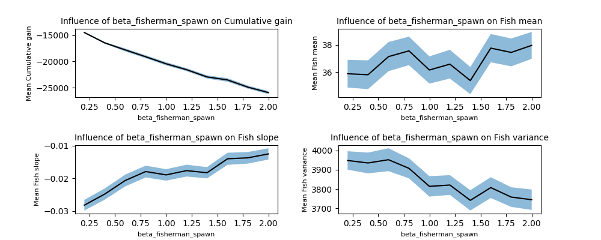

# ABM Overfishing

## Layout
This file contains two sections. First, in this section, we briefly discuss how this model works and how to use it.
The second part will contain OFAT analyses for the different parameters in this model, which serves as an extension to the paper we wrote for the ABM course of the UvA. (There were simply too many results to include in a paper, so they are shown here.)

### The Model
We created an ABM in order to investigate the qualitative behaviours of using no-fishing zones and quota as a means to counteract overfishing, which is a current problem and a topic of hot debate. We emphasize the word 'qualitative' here, since it is quite difficult to actually incorporate enough complexity to make such a model sufficiently accurate and realistic. Therefore, we chose to keep the model as simple as we could. Here we briefly go over the most important files and explain what is found within. We will discuss the model itself first, and afterwards provide some information for using the OFAT and Sobol analysis techniques which are also provided, along with a visualization method for the model. We'll provide information per file.

#### main.py
This is the main calling file for the model. One simply enters the fraction of the map they want to be a no-fishing zone, or the quotum value, and runs the file. This will trigger the model to run for the specified amount of iterations, and afterwards display a graph showing the results.

#### model.py
This contains the actual 'environment' for the model. Here all the parameters are set, the agents are initialised and the model is run. For brevity's sake, we will not go over the parameters here. For an overview of these parameters please refer to the accompanying research paper. The environment is a 2D square discrete lattice where agents are spawned and interact with each other. These agents are Fish (which are fish schools), Fishermen (who of course catch fish), and Food (which serves as a resource to the fish). To get an overview of how the model works, also refer to our research paper.

#### agent.py
This contains the agents that are needed for the model, which are Fish (schools), Fishermen, and Food.

#### visual.py
This file lets one visually run the model from the browser. Run this and start the model run from the browser. The parameters of the model must be set in the model.py file. Only the no-fishing zones and quota values can be set in the browser.

#### OFATi.py
This file is used for OFAT (One Factor At a Time) analysis, which allows you to quickly look at the influence of parameters, without taking into account the interdependency between parameters. This file only allows for a single replication of the parameters chosen, because we chose to split up the work load over several computers/cores. Thus, for full effectiveness, this file can be run in parallel over several terminals/computers. The results are saved to a common directory.

#### SOBOLi.py
This file is similar to the OFAT file described above, only it employs the Sobol analysis technique, which accounts for the interaction between different parameters. This file is also set to only create 1 replicate, and is run in parallel over multiple terminals/computers for the same reasons as above.

#### Remaining files
The remaining files are less important and serve as data, data merging, and plotting files which were used specifically for our research. We chose to leave these files in for completeness' sake, but can otherwise be ignored.

### Extra results from the research paper
Here we add additional OFAT results we didn't include in our main research paper for the sake of brevity. We discuss the most interesting/important ones in our paper, but they are all shown here without discussion, just for completeness.

